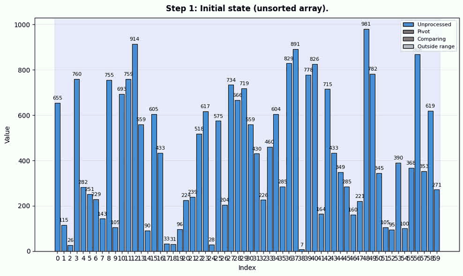

# MultiModal Coding Agent for Python
This project is a coding agent tailored for the Python language.

## Features
- Configurable Agent mode
    - Single Agent mode
    - Multi-agent mode (PM, Coder, QA)
- Self-correction mechanism
- Visual feedback loop

## Requirements
- Ollama is running
- uv python environment is activated

## Edit agent config
The configuration can be modified via yaml file.
```yaml
# agent_config.yaml
mode: "single"  # or "multi"
host: "localhost:11434"  # Ollama host
model: "qwen3.6:35b"  # Ollama model
max_steps: 5  # Maximum number of steps for the agent
max_agent_turns: 5  # Maximum number of turns for the multi-agent system
```

## Run
```bash
# install dependencies
uv sync

# run program
uv run main.py
```

The results are saved to the workspace directory. `workspace` folder is created automatically when the program starts.

## Example
```bash
user -> Please write a quick sort. The intermediate process should be sequentially visualized and saved in png format.
```

## Results
The following is the result of the multi-agent mode with the qwen3.6:35b model.
Note: I manually created a gif from the workspace folder.

<div align="center">
    
</div>